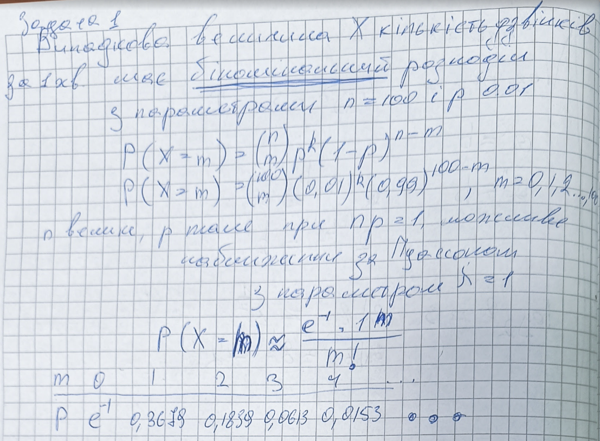
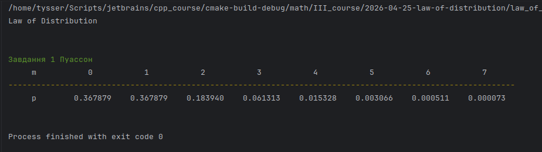
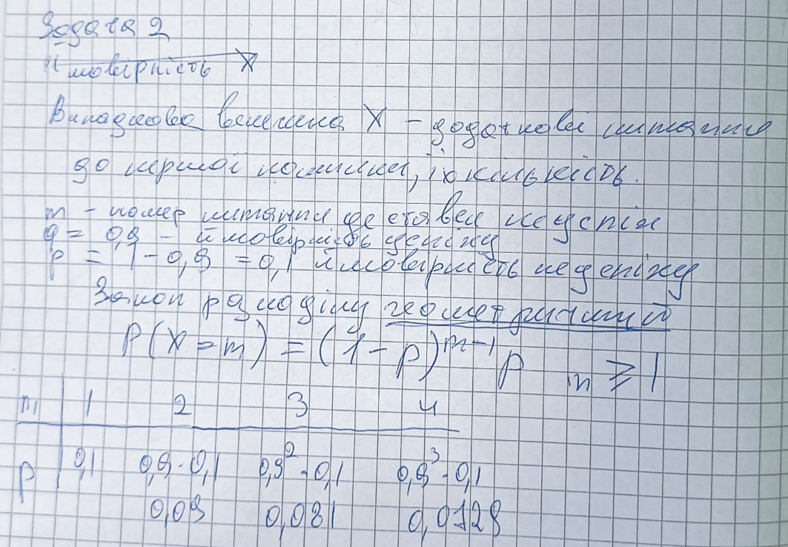
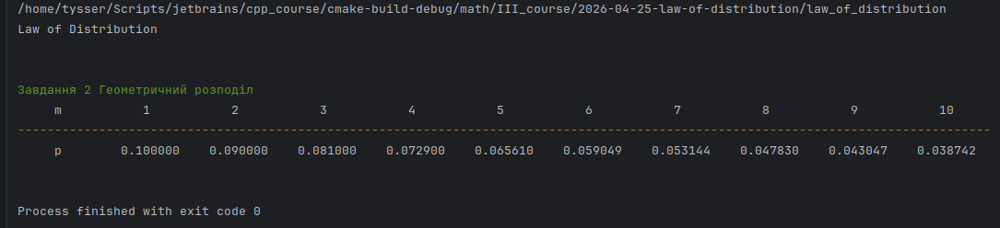
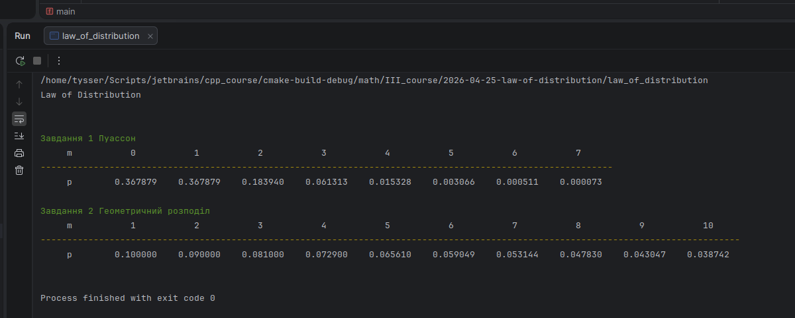

# Закон розподілу

[](https://uk.wikipedia.org/wiki/Категорія:Дискретні_розподіли)

## Мета

Визначити та обчислити закон розподілу для різних випадків

## Завдання 1

Комутатор деякого підприємства обслуговує `100` клієнтів, імовірність дзвінка за `1` хвилину
на комутатор дорівнює `0,01`. Записати закон розподілу кількості дзвінків на комутатор протягом `1` хвилини.

Так як задано $n = 100$, кількість клієнтів, незалежних випробовувань, і що кожне може відбутися з імовірністю $p = 0.01$
а величина $X$ рахує кількість успіхів — це точно відповідає [біноміальному розподілу](https://uk.wikipedia.org/wiki/Біноміальний_розподіл) (wikipedia).
У загальному випадку за [схемою Бернуллі](https://uk.wikipedia.org/wiki/Розподіл_Бернуллі) (wikipedia):

$$
P(X=m)=C_{100}^m \cdot p^m \cdot q^{100-m}
$$

$$
P(X = m) = \binom{100}{m} (0.01)^m (0.99)^{100 - m}, \quad m = 0,1,2,\ldots,100
$$

(Див. в цьому репозиторію [порівняльну характеристику](https://github.com/yourhostel/cpp_course/tree/main/math/III_course/2026-04-20-bernoulli-laplace-poisson-review))

Коли $n$ велике, $p$ мале і $np = \lambda$ дорівнює $1$, доцільно застосувати модель [наближення Пуассона](https://uk.wikipedia.org/wiki/Розподіл_Пуассона) (wikipedia)

$P(X=m)\approx \frac{1^m e^{-1}}{m!}$






## Завдання 2

Екзаменатор задає студентам додаткові питання імовірність того, що студенти знатимуть
відповідь на будь-яке питання дорівнює `0,9`. Використовуючи припущення, що іспит закінчиться,
якщо студент не знає запропоноване питання знайти закон розподілу числа
заданих додаткових запитань екзаменатором.

Випробування повторюються доти, поки не відбудеться перший неуспіх. 
Це ознака [геометричного розподілу](https://uk.wikipedia.org/wiki/Геометричний_розподіл) (wikipedia).
Випадкова величина $X$ це номер випробування, на якому вперше з’являється неуспіх. 
Імовірність неуспіху $p = 0.1$, імовірність успіху $q = 0.9$.

$$
P(X = m) = q^{m-1} \cdot p = (0.9)^{m-1} \cdot 0.1
$$

$$
P(X = m) = (0.9)^{m-1} \cdot 0.1, \quad m = 1,2,3,\ldots \quad m \geq 1
$$







---

## Висновок

У першій задачі процес із фіксованою кількістю незалежних випробувань описується 
біноміальним розподілом з `n = 100` та `p = 0.01`, з можливим наближенням Пуассона при np = 1.

У другій задачі процес триває до першого неуспіху, тому використовується геометричний розподіл з `p = 0.1` та `q = 0.9`.

Вибір розподілу визначається структурою експерименту.

Результати перевірено за допомогою власної бібліотеки для розрахунків і виводу в консоль. 
([lib](https://github.com/yourhostel/cpp_course/tree/main/math/III_course/lib))

---

```bash
pandoc README.md -s \
  --pdf-engine=xelatex \
  --columns=60 \
  -V mainfont="DejaVu Serif" \
  -V monofont="DejaVu Sans Mono" \
  -V fontsize=12pt \
  -V linestretch=1.15 \
  -V geometry:a4paper \
  -V geometry:margin=20mm \
  -V geometry:landscape \
  --toc --toc-depth=3 \
  --number-sections \
  --metadata title="Теорія ймовірностей та математична статистика" \
  --metadata subtitle="Дискретні розподіли. Повторення" \
  --metadata author="Тищенко Сергій, alk-43" \
  --metadata date="2026-04-25" \
  -H ../../../header.tex \
  -o README.pdf
```
