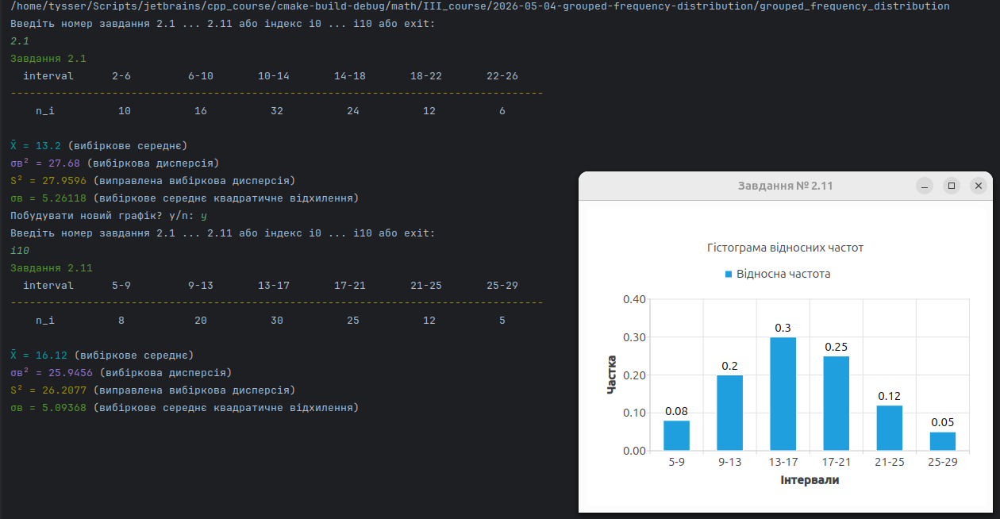

# Практичне заняття №13. ЗМІ. Тема 7

## Завдання

Дано інтервальний варіаційний ряд. У першому рядку вказано часткові інтервали $a_{i-1} - a_i$,
у другому рядку вказано відповідні їм частоти $n_i$.

Побудувати гістограму відносних частот.

# Хід виконання

## Представлення даних

Для зручного виконання завдання початкові дані подано у вигляді структур.

[grouped_frequency_tasks.hpp](https://github.com/yourhostel/cpp_course/blob/main/math/III_course/2026-05-04-grouped-frequency-distribution/grouped_frequency_tasks.hpp)

```cpp
struct interval_frequency
{
    std::string interval; // "2-6"
    int frequency;        // n_i
};

struct grouped_frequency_task
{
    std::string task_number; // "2.1"
    std::vector<interval_frequency> data;
};

inline const std::vector<grouped_frequency_task> tasks
{
    {
        "2.1",
        {
            {"2-6", 10},
            {"6-10", 16},
            {"10-14", 32},
            {"14-18", 24},
            {"18-22", 12},
            {"22-26", 6}
        }
    },
    ...
    {
        "2.11",
        ...
    }
};

inline const std::unordered_map<std::string, std::size_t> task_index
{
    {"2.1", 0},
    ...,
    {"2.11", 10}
};
```

- Структура `interval_frequency` описує один інтервал варіаційного ряду та його абсолютну частоту.
- Поле `interval` зберігає текстове представлення інтервалу, наприклад `"2-6"`.
- Поле `frequency` зберігає абсолютну частоту $n_i$, тобто кількість значень, які потрапили у відповідний інтервал.
- Структура `grouped_frequency_task` описує одне завдання. 
  - Поле `task_number` зберігає номер завдання, наприклад `"2.1"`
  - поле `data` зберігає список інтервалів і частот.
- `tasks` є вектором усіх завдань. Для зручного звертання до завдання
  за його номером використовується асоціативний контейнер `task_index`,
  де ключем є номер завдання, а значенням є індекс цього завдання у векторі `tasks`.

### Пошук завдання

> Для вибору потрібного завдання використовується функція `find_task`.

```cpp
const grouped_frequency_task* find_task(const std::string& input)
{
    if (input.starts_with('i'))
    {
        const std::size_t index = std::stoul(input.substr(1));
        return index < tasks.size() ? &tasks[index] : nullptr;
    }

    const auto it = task_index.find(input);
    return it != task_index.end() ? &tasks.at(it->second) : nullptr;
}
```

- Функція підтримує два способи звертання до завдання:
  - Перший спосіб це звертання за номером завдання, наприклад `2.1`, `2.2`, `2.11`.
  - Другий спосіб це звертання за індексом у векторі через префікс `i`, наприклад `i0`, `i1`, `i10`.
  - Якщо завдання знайдено, функція повертає покажчик на відповідний об’єкт `grouped_frequency_task`.
  - Якщо введене значення некоректне або такого завдання немає, функція повертає `nullptr`.

## Розрахунок та підготовка даних для відображення

У початковому завданні задано абсолютні частоти $n_i$. Проте гістограму потрібно побудувати для відносних частот.

Відносна частота обчислюється за формулою:

$$
w_i = \frac{n_i}{N}
$$

де $n_i$ це частота окремого інтервалу, а $N$ це загальна кількість спостережень.

Загальна кількість спостережень обчислюється як сума всіх частот:

$$
N = \sum_i n_i
$$

Для завдання `2.1`:

$$
N = 10 + 16 + 32 + 24 + 12 + 6 = 100
$$

Наприклад, для інтервалу `2-6` відносна частота дорівнює:

$$
w_1 = \frac{10}{100} = 0.10
$$

### Функція to_relative_histogram_data

> Функція виконує перетворення початкових даних у формат, придатний для побудови гістограми.

```cpp
std::vector<histogram_bar> to_relative_histogram_data(const grouped_frequency_task& task)
{
    const int total = std::ranges::fold_left(
        task.data | std::views::transform(&interval_frequency::frequency),
        0,
        std::plus{}
    );

    return task.data
        | std::views::transform([total](const auto& item)
        {
            return histogram_bar
            {
                .category = item.interval,
                .value = static_cast<double>(item.frequency) / total
            };
        })
        | std::ranges::to<std::vector<histogram_bar>>();
}
```

- Функція виконує два кроки.
  - Обчислює суму всіх абсолютних частот.
  - Для кожного інтервалу обчислює відносну частоту.

1. У першій частині використовується `std::ranges::fold_left`. Він проходить по всіх частотах і накопичує їх суму.

```cpp
const int total = std::ranges::fold_left(
    task.data | std::views::transform(&interval_frequency::frequency),
    0,
    std::plus{}
);
```

Вираз `std::views::transform(&interval_frequency::frequency)` бере з кожного елемента тільки поле `frequency`.
Після цього `fold_left` додає ці значення і формує загальну кількість спостережень.

2. У другій частині функція створює вектор `histogram_bar`.

```cpp
return task.data
    | std::views::transform([total](const auto& item)
    {
        return histogram_bar
        {
            .category = item.interval,
            .value = static_cast<double>(item.frequency) / total
        };
    })
    | std::ranges::to<std::vector<histogram_bar>>();
```

- Поле `category` отримує інтервал, який буде підписом по осі X.
- Поле `value` отримує відносну частоту, яка буде висотою відповідного стовпчика гістограми.
- Приведення `static_cast<double>` потрібне для того, щоб виконати дійсне ділення, а не цілочисельне.

### Підготовка таблиці для консольного виведення

> Окремо формується таблиця початкових даних, яка виводиться у консоль перед побудовою графіка.
> Функція `to_table_data` перетворює список інтервалів і частот у формат,
> який очікує функція табличного виведення `print_distribution_table`.

```cpp
std::vector<table_row<std::string>> to_table_data(const grouped_frequency_task& task)
{
    return task.data
        | std::views::transform([](const auto& item)
        {
            return table_row<std::string>
            {
                .value_first = item.interval,
                .value_second = std::to_string(item.frequency)
            };
        })
        | std::ranges::to<std::vector<table_row<std::string>>>();
}
```

Поле `value_first` містить інтервал.
Поле `value_second` містить частоту, перетворену на рядок.

Перетворення через `std::to_string` використовується тому,
що структура `table_row<T>` має однаковий тип для обох полів.
У цьому випадку і інтервал, і частота передаються як `std::string`.

### Виведення таблиці у консоль

> Після підготовки даних викликається функція `print_distribution_table`.

```cpp
print_distribution_table(
    "Завдання",
    task.task_number,
    "interval",
    "n_i",
    table_data
);
```

- Перший параметр задає загальну назву виводу.
- Другий параметр задає номер завдання.
- Третій параметр задає назву першого рядка таблиці.
- Четвертий параметр задає назву другого рядка таблиці.
- П’ятий параметр містить підготовлені дані.

Для уникнення зміщення у консольній таблиці назву першого рядка доцільно задавати латинськими символами,
наприклад `"interval"`. Це пов’язано з тим, що поточна функція центрування використовує `std::string::size()`,
а вона рахує байти, а не видиму ширину символів UTF-8.

### Побудова гістограми

> Побудова гістограми виконується через допоміжну функцію `create_histogram_chart_view` з бібліотеки `Print`.

```cpp
const histogram_options options
{
    .window_title = std::format("Завдання № {}", task.task_number),
    .set_name = "Відносна частота",
    .chart_title = "Гістограма відносних частот",
    .y_axis_title = "Частка",
    .x_axis_title = "Інтервали",
    .y_min = 0.0,
    .y_max = 0.4,
    .width = 800,
    .height = 600,
    .precision = 2
};
```

| Поле           | Опис                                             |
|----------------|--------------------------------------------------|
| `window_title` | Назва вікна                                      |
| `set_name`     | Назва набору стовпчиків                          |
| `chart_title`  | Заголовок діаграми                               |
| `y_axis_title` | Підпис осі Y                                     |
| `x_axis_title` | Підпис осі X                                     |
| `y_min`        | Нижня межа вертикальної шкали                    |
| `y_max`        | Верхня межа вертикальної шкали                   |
| `width`        | Ширина вікна                                     |
| `height`       | Висота вікна                                     |
| `precision`    | Кількість знаків після коми для підписів значень |


Після налаштування параметрів створюється графік.

```cpp
auto chart_view = create_histogram_chart_view(histogram_data, options);
chart_view->show();
```

Функція `create_histogram_chart_view` повертає `std::unique_ptr<QChartView>`.
Це означає, що об’єкт графіка керується автоматично і не потребує ручного виклику `delete`.

### Функція показу завдання

Функція `show_task_chart` об’єднує підготовку даних, друк таблиці та побудову графіка.

Функція повертає `std::unique_ptr<QChartView>`, щоб вікно графіка залишалося живим після виходу з функції.
Якщо повернути локальний об’єкт без збереження, графік буде одразу знищений.

# Організація роботи програми

Точка входу винесена в окрему функцію `test`, у якій створюється об’єкт 
`QApplication` і запускається цикл взаємодії з користувачем.

У функції реалізовано нескінченний цикл, який виконує наступні дії:

- Запитує у користувача номер завдання або індекс.
- Виконує пошук відповідного завдання.
- У разі успіху:
  - виводить таблицю інтервального варіаційного ряду у консоль;
  - відкриває вікно з гістограмою відносних частот.
- Після закриття вікна запитує, чи потрібно побудувати новий графік.
- Якщо введено y, цикл повторюється, інакше програма завершується.

## Висновок

Реалізовано інтерактивний режим роботи, який дозволяє:

- обирати завдання за номером або індексом;
- переглядати табличне представлення даних;
- будувати гістограму відносних частот;
- послідовно працювати з кількома завданнями без перезапуску програми.

Початкові дані відокремлені від логіки обчислень,
а візуалізація і консольний вивід виконуються незалежними компонентами.



---

```bash
pandoc README.md -s \
  --pdf-engine=xelatex \
  --columns=60 \
  -V mainfont="DejaVu Serif" \
  -V monofont="DejaVu Sans Mono" \
  -V fontsize=12pt \
  -V linestretch=1.15 \
  -V geometry:a4paper \
  -V geometry:margin=20mm \
  -V geometry:landscape \
  --toc --toc-depth=3 \
  --number-sections \
  --metadata title="Теорія ймовірностей та математична статистика" \
  --metadata subtitle="Побудова гістограм відносних частот для інтервальних варіаційних рядів" \
  --metadata author="Тищенко Сергій, alk-43" \
  --metadata date="2026-05-05" \
  -H ../../../header.tex \
  -o README.pdf
```
