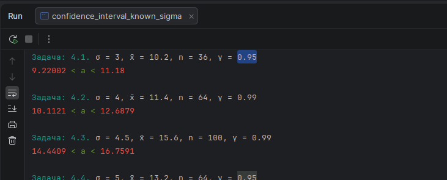
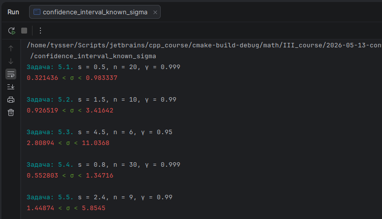

# Практичне заняття №14. ЗМІ. Тема 7.

** ТІМС-ЛПР14+. Побудова довірчих інтервалів **

## Теоретичні позначення

Нехай:

$$
Z \sim N(0,1)
$$

тобто $Z$ це стандартна нормальна випадкова величина.

Функція розподілу стандартного нормального закону:

$$
F(x)=P(Z\le x)
$$

У Boost.Math їй відповідає:

```cpp
boost::math::cdf(
    boost::math::normal_distribution<>(),
    x
)
```

Обернена функція розподілу або квантиль:

$$
F^{-1}(p)
$$

У Boost.Math їй відповідає:

```cpp
boost::math::quantile(
    boost::math::normal_distribution<>(),
    p
)
```

Для двостороннього надійного інтервалу використовується:

$$
p=\frac{1+\gamma}{2}
$$

тому критичне значення:

$$
t_{\gamma} = F^{-1}\left(\frac{1+\gamma}{2}\right)
$$

## Задача 1

Побудувати надійний інтервал для оцінки з надійністю $\gamma$ невідомого математичного сподівання $a$ нормально
розподіленої генеральної сукупності $X$, якщо відомі середнє квадратичне відхилення $\sigma$,
вибіркове середнє $\overline{x}$ і об’єм вибірки $n$.


$$
a_1 < a < a_2
$$

Для цієї задачі потрібні дві функції.

Перша функція обчислює критичне значення стандартного нормального розподілу:

```cpp
    /**
     * Критичне значення стандартного нормального розподілу
     * для двостороннього надійного інтервалу.
     * @param gamma надійність оцінки з інтервалу (0, 1)
     * @return t_gamma
     */
    template <floating_point_like Real = double>
    Real normal_critical(Real gamma);
```

Її математична модель:

$$
t_{\gamma} = F^{-1}\left(\frac{1+\gamma}{2}\right)
$$

Друга функція будує сам надійний інтервал:

```cpp
    /**
     * Надійний інтервал для математичного сподівання a
     * нормально розподіленої генеральної сукупності X
     * при відомому sigma.
     * @param x_bar вибіркове середнє
     * @param sigma середнє квадратичне відхилення генеральної сукупності
     * @param n об’єм вибірки
     * @param gamma надійність оцінки
     * @return нижня і верхня межа надійного інтервалу
     */
    template <floating_point_like Real = double>
    confidence_interval<Real> mean_confidence_interval_known_sigma(
        Real x_bar,
        Real sigma,
        int n,
        Real gamma
    );
```

Математична модель:

$$
a_1=\overline{x}-t_{\gamma}\frac{\sigma}{\sqrt{n}}; \quad a_2=\overline{x}+t_{\gamma}\frac{\sigma}{\sqrt{n}}
$$

Сховище `confidence_interval_known_sigma` містить масив задач із вхідними параметрами:

$$
\sigma,\ \overline{x},\ n,\ \gamma
$$

Масив задач обходиться циклом. Для кожної задачі викликається функція:

```cpp
mean_confidence_interval_known_sigma(
    x_bar,
    sigma,
    n,
    gamma
)
```

Функція повертає нижню і верхню межі надійного інтервалу:

$$
a_1 < a < a_2
$$

Результати обчислень виводяться у консоль:



## Задача 2

Побудувати надійний інтервал для оцінки з надійністю $\gamma$ невідомого середнього квадратичного 
відхилення $\sigma$ нормально розподіленої генеральної сукупності $X$, якщо відомі виправлене
середнє квадратичне відхилення $s$ і об’єм вибірки $n$.

$$
\sigma_1 < \sigma < \sigma_2
$$

Для цієї задачі потрібні дві функції.

Перша функція обчислює квантиль розподілу $\chi^2$:

```cpp
    /**
     * Квантиль розподілу chi squared.
     * @param p ймовірність з інтервалу (0, 1)
     * @param k число ступенів свободи
     * @return chi_squared_p
     */
    template <floating_point_like Real = double>
    Real chi_squared_critical(
        Real p,
        Real k
    );
```

Її математична модель:

$$
\chi_p^2 = F_{\chi^2}^{-1}(p)
$$

Де $F_{\chi^2}^{-1}(p)$ це обернена функція розподілу $\chi^2$ з числом ступенів свободи:

$$k = n - 1$$

У реалізації через Boost.Math:

```cpp
boost::math::quantile(
    boost::math::chi_squared_distribution<>(k),
    p
)
```

Друга функція будує сам надійний інтервал:

```cpp
    /**
     * Надійний інтервал для середнього квадратичного відхилення sigma
     * нормально розподіленої генеральної сукупності X.
     * @param s виправлене середнє квадратичне відхилення
     * @param n об’єм вибірки
     * @param gamma надійність оцінки
     * @return нижня і верхня межа надійного інтервалу
     */
    template <floating_point_like Real = double>
    confidence_interval<Real> sigma_confidence_interval(
        Real s,
        int n,
        Real gamma
    );
```

Математична модель:

$$
\sigma_1=s\sqrt{\frac{n-1}{\chi^2_{\frac{1+\gamma}{2}}}}; \quad \sigma_2=s\sqrt{\frac{n-1}{\chi^2_{\frac{1-\gamma}{2}}}}
$$

| Позначення   | Опис                                                |
|--------------|-----------------------------------------------------|
| $$\sigma_1$$ | нижня межа надійного інтервалу                      |
| $$\sigma_2$$ | верхня межа надійного інтервалу                     |
| $$s$$        | виправлене середнє квадратичне відхилення вибірки   |
| $$n$$        | об’єм вибірки                                       |
| $$\gamma$$   | надійність оцінки                                   |
| $$\chi^2_p$$ | квантиль розподілу $$\chi^2$$ для ймовірності $$p$$ |
| $$k=n-1$$    | число ступенів свободи                              |


Сховище `confidence_interval_sigma` містить масив задач із вхідними параметрами:

$$
s,\ n,\ \gamma
$$

Масив задач обходиться циклом. Для кожної задачі викликається функція:

```cpp
sigma_confidence_interval(
    s,
    n,
    gamma
)
```

Функція повертає нижню і верхню межі надійного інтервалу:

$$
\sigma_1 < \sigma < \sigma_2
$$



В обох випадках, і в задачі 1 і в задачі 2, функції повертають структуру `confidence_interval` (довірчий інтервал):

```cpp
template <floating_point_like Real = double>
struct confidence_interval
{
    Real lower;
    Real upper;
};
```

Де `floating_point_like`:

```cpp
template <typename T>
concept floating_point_like = std::floating_point<T>;
```

Тобто Real це тип даних з плаваючою крапкою, який підтримує операції над дійсними числами.
За замовчуванням використовується тип `double`, але його можна перевизначити на:

- `float`
- `double`
- `long double`

Висновки:

В задачі 1 обчислюється надійний інтервал для оцінки невідомого математичного сподівання $a$ 
нормально розподіленої генеральної сукупності $X$. Отриманий інтервал означає, що істинне
математичне сподівання генеральної сукупності з надійністю $\gamma$ лежить у межах:

$$
a_1 < a < a_2
$$

В задачі 2 обчислюється надійний інтервал для оцінки невідомого середнього квадратичного відхилення $\sigma$
нормально розподіленої генеральної сукупності $X$. Отриманий інтервал означає, що істинне середнє квадратичне 
відхилення генеральної сукупності з надійністю $\gamma$ лежить у межах:

$$
\sigma_1 < \sigma < \sigma_2
$$

---

```bash
pandoc README.md -s \
  --pdf-engine=xelatex \
  --columns=60 \
  -V mainfont="DejaVu Serif" \
  -V monofont="DejaVu Sans Mono" \
  -V fontsize=12pt \
  -V linestretch=1.15 \
  -V geometry:a4paper \
  -V geometry:margin=20mm \
  --toc --toc-depth=3 \
  --number-sections \
  --metadata title="Теорія ймовірностей та математична статистика" \
  --metadata subtitle="Практичне заняття №14. ЗМІ. Тема 7." \
  --metadata author="Тищенко Сергій, alk-43" \
  --metadata date="2026-05-14" \
  -H ../../../header.tex \
  -o README.pdf
```