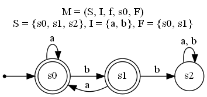

# Завдання 8: Побудова скінченного автомата

## Опис завдання

Дано таблицю функції переходів `f` скінченного автомата `M = (S, I, f, s0, F)`:
- **S** — множина внутрішніх станів: `{s0, s1, s2}`.
- **I** — вхідний алфавіт: `{a, b}`.
- **s0** — початковий стан: `s0`.
- **F** — множина заключних станів: `{s0, s1}`.

### Таблиця переходів:

| Стан | Вхід `a` | Вхід `b` |
|------|----------|----------|
| `s0` | `s0`     | `s1`     |
| `s1` | `s0`     | `s2`     |
| `s2` | `s2`     | `s2`     |

### Завдання:
1. Побудувати діаграму станів скінченного автомата.

---

## Розв'язання

### 1. Побудова діаграми станів

Діаграму було створено за допомогою бібліотеки **Graphviz**.
Опис скінченного автомата для створення діаграми у файлі `automaton.dot`

```bash
dot -Tpng automaton.dot -o diagram.png
```




